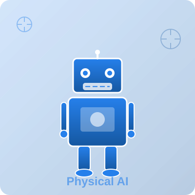

# Physical AI & Humanoid Robotics Textbook

<div align="center">



**From Digital Intelligence to Embodied Robots**

[](https://opensource.org/licenses/MIT)
[](https://docusaurus.io/)
[](https://fastapi.tiangolo.com)
[](https://www.python.org/downloads/)

[Live Demo](#) | [Documentation](#-documentation) | [Contributing](#-contributing)

</div>

## 📖 About

**Physical AI & Humanoid Robotics** is a comprehensive, interactive learning platform designed to bridge the gap between traditional digital AI and embodied physical AI systems. This open-source textbook provides hands-on education in robotics, ROS 2, simulation, NVIDIA Isaac, and humanoid robot development.

### Why This Textbook?

- 🎓 **Complete Learning Path**: 26 structured chapters from fundamentals to advanced humanoid development
- 💡 **Hands-On Approach**: Every chapter includes practical code examples and exercises
- 🤖 **RAG-Powered Chatbot**: AI assistant providing contextual help with chapter citations
- 🎨 **Modern Design**: Professional UI inspired by Agent Factory standards
- 💰 **Free & Open Source**: Built entirely on free-tier services (Gemini, Qdrant, GitHub Pages)
- 🚀 **Production-Ready**: Follows Spec-Driven Development with complete documentation

### Learning Outcomes

By completing this textbook, learners will:

- Master the transition from digital AI to physical, embodied AI systems
- Build production-ready robots using ROS 2 and NVIDIA Isaac
- Understand sensor fusion, perception, planning, and control
- Develop simulation environments for safe, rapid prototyping
- Implement Vision-Language-Action (VLA) models for humanoid robots
- Deploy real-world robotic applications with proper software architecture

## 🎯 Project Overview

This project delivers 26 chapters across 7 parts, covering:

1. **Foundations of Physical AI** (Chapters 1-4)
2. **ROS 2 Fundamentals** (Chapters 5-9)
3. **Simulation** - Gazebo & Unity (Chapters 10-13)
4. **NVIDIA Isaac Platform** (Chapters 14-18)
5. **Humanoid Development** (Chapters 19-22)
6. **Vision-Language-Action Models** (Chapters 23-25)
7. **Capstone Project** (Chapter 26)

## 🏗️ Architecture

### Tech Stack

| Layer | Technology |
|-------|-----------|
| **Frontend** | Docusaurus 3.x + TypeScript + React 18 |
| **Backend** | FastAPI + Python 3.11+ |
| **LLM** | Gemini 1.5 Flash (free tier) |
| **Embeddings** | Gemini text-embedding-004 |
| **Vector Store** | Qdrant Cloud (free tier) |
| **Hosting** | GitHub Pages (book) + Vercel (backend) |

### Project Structure

```
physical-ai-textbook/
├── apps/learn-app/           # Docusaurus frontend
│   ├── docs/                 # 26 chapters in MDX
│   ├── src/
│   │   ├── components/       # React components
│   │   ├── pages/            # Landing page
│   │   └── css/              # Styling
│   ├── static/               # Assets
│   ├── docusaurus.config.ts
│   └── sidebars.ts
│
├── backend/                  # FastAPI backend
│   ├── app/
│   │   ├── routers/          # API endpoints
│   │   ├── services/         # Business logic
│   │   ├── models/           # Pydantic schemas
│   │   ├── config.py         # Configuration
│   │   └── main.py           # FastAPI app
│   ├── scripts/              # Utility scripts
│   └── tests/                # Test suite
│
├── specs/                    # Feature specifications
├── history/                  # PHRs and ADRs
├── .specify/                 # SpecKit Plus
└── package.json              # Root workspace config
```

## 🚀 Getting Started

### Prerequisites

- **Node.js**: >= 20.0.0
- **pnpm**: >= 8.0.0
- **Python**: >= 3.11
- **uv**: Python package manager (recommended)

### Installation

1. **Clone the repository**

```bash
git clone git@github.com:Mubeen-Fatima/Physical-AI-Humanoid-Robotics-Book.git
cd Physical-AI-Humanoid-Robotics-Book
```

2. **Install frontend dependencies**

```bash
pnpm install
```

3. **Install backend dependencies**

```bash
cd backend
uv sync
# Or with pip:
pip install -e ".[dev]"
```

### Environment Configuration

1. **Frontend** (`.env.local` in `apps/learn-app/`)

```env
BACKEND_URL=http://localhost:8000
```

2. **Backend** (`.env` in `backend/`)

```env
GEMINI_API_KEY=your_google_ai_studio_key
QDRANT_URL=https://your-cluster.qdrant.io
QDRANT_API_KEY=your_qdrant_api_key
LOG_LEVEL=INFO
CORS_ORIGINS=http://localhost:3000
```

### Running Development Servers

**Frontend (Docusaurus)**

```bash
pnpm dev
# Runs on http://localhost:3000
```

**Backend (FastAPI)**

```bash
cd backend
uv run fastapi dev app/main.py
# Or with uvicorn:
uvicorn app.main:app --reload
# Runs on http://localhost:8000
```

## 📊 Implementation Status

**Progress**: 40/88 tasks complete (45%)

### ✅ Completed Phases

#### Phase 1: Setup (T001-T008) ✓
- Monorepo structure with pnpm workspace
- Docusaurus 3.x app with TypeScript
- FastAPI backend with Python 3.11+
- Development tooling (Black, Flake8, MyPy)

#### Phase 2: Foundational Infrastructure (T009-T017) ✓
- Backend configuration with environment variables
- Pydantic models for chat and vector operations
- Gemini API client with retry logic (2s exponential backoff)
- Qdrant client with storage monitoring (80%/95% warnings)
- FastAPI app with CORS middleware

#### Phase 3: Landing Page (T018-T027) ✓
- Hero section with animated spotlight effect
- Value Cards highlighting ROS 2, Simulation, Isaac AI, Humanoids
- Comparison Table: Digital AI vs Physical AI
- Learning Path visualization (7-part progression)
- Hardware Tiers: Economy ($700), Standard ($2000), Cloud
- Agent Factory-inspired styling (blue theme, larger fonts, generous spacing)
- SVG assets and functional CTAs

#### Phase 4: Book Content (T028-T040) ✓
- Directory structure for 7 parts (Foundations, ROS 2, Simulation, Isaac, Humanoid, VLA, Capstone)
- **Preface**: Introduction to Physical AI and book structure
- **Chapter 1**: Physical AI fundamentals with sensor fusion tutorial
- **Chapter 2**: ROS 2 software stack introduction
- **Chapter 3**: Robot kinematics and coordinate frames
- **Chapter 4**: Sensors and perception fundamentals
- **Chapter 5**: ROS 2 Navigation stack
- Sidebar navigation with collapsible sections
- Syntax-highlighted code examples (Python, YAML, CMake)
- Chapter navigation (previous/next buttons) functional

### 🚧 Next Steps

**Immediate priorities:**

- **Phase 5**: RAG Chatbot (US2) - 18 tasks
  - MDX parser for chapter chunking
  - Gemini embedding generation
  - Qdrant vector search integration
  - Chat widget UI with rate limiting

- **Phase 6**: Text Selection Feature (US3) - 8 tasks
- **Phase 8**: Deployment to GitHub Pages + Vercel - 9 tasks

See `specs/001-physical-ai-textbook/tasks.md` for full task breakdown.

### 🎥 Screenshots

**Landing Page**
- Professional hero section with animated robot illustration
- Comprehensive value propositions and learning path
- Hardware tier recommendations

**Book Interface**
- Clean, readable typography (Agent Factory styling)
- Organized sidebar with collapsible sections
- Code syntax highlighting with copy button

## 📖 API Endpoints

### Health Check

```
GET  /          # Basic health check
GET  /health    # Detailed health status
```

### Chat Endpoints (Coming in Phase 5)

```
POST /api/chat              # General chatbot query
POST /api/chat/selected     # Contextual help for selected text
```

## 🎨 Key Features

- **26 Interactive Chapters** with hands-on code examples
- **RAG-Powered Chatbot** answering questions with chapter citations
- **Custom Landing Page** matching Agent Factory design standards
- **Text Selection Help** for contextual explanations
- **Free-Tier Deployment** with no cost overruns
- **Client-Side Rate Limiting** for Gemini API (15 RPM)
- **Storage Monitoring** for Qdrant (1GB limit)

## 🧪 Testing

```bash
# Backend tests
cd backend
pytest

# Frontend tests (when added)
cd apps/learn-app
pnpm test
```

## 📝 Development Workflow

This project follows **Spec-Driven Development** (SDD):

1. **Specification** → `specs/001-physical-ai-textbook/spec.md`
2. **Architecture Plan** → `specs/001-physical-ai-textbook/plan.md`
3. **Task Breakdown** → `specs/001-physical-ai-textbook/tasks.md`
4. **Implementation** → Phase-by-phase execution
5. **Prompt History** → `history/prompts/001-physical-ai-textbook/`

## 📚 Documentation

- **Constitution**: `.specify/memory/constitution.md`
- **Spec**: `specs/001-physical-ai-textbook/spec.md`
- **Plan**: `specs/001-physical-ai-textbook/plan.md`
- **Tasks**: `specs/001-physical-ai-textbook/tasks.md`

## 🤝 Contributing

We welcome contributions! Here's how you can help:

### Development Process

This project follows **Spec-Driven Development** (SDD):

1. Review `specs/001-physical-ai-textbook/tasks.md` for open tasks
2. Check existing issues and PRs
3. Create a feature branch: `git checkout -b feature/your-feature-name`
4. Implement following the spec and plan documents
5. Write tests (when applicable)
6. Commit with descriptive messages
7. Push and create a Pull Request

### Priority Areas

- **Content**: Write or improve chapter content (Chapters 6-26)
- **RAG Chatbot**: Implement Phase 5 tasks (T041-T058)
- **Testing**: Add unit and integration tests
- **Documentation**: Improve setup guides and API docs
- **UI/UX**: Enhance landing page and chapter layouts

### Code Standards

- **Python**: Follow PEP 8, use Black, pass Flake8 and MyPy
- **TypeScript**: Follow project ESLint config
- **Commits**: Use conventional commits format
- **PHRs**: Create Prompt History Records for significant changes

See `specs/001-physical-ai-textbook/tasks.md` for detailed task breakdown.

## 🌟 Acknowledgments

- **Panaversity** for the educational vision
- **Agent Factory** for design inspiration
- **NVIDIA Isaac** team for simulation resources
- **ROS 2** community for robotics excellence

## 📄 License

MIT License - Copyright © 2026 Panaversity

See [LICENSE](LICENSE) for full details.

## 🔗 Links

- **Live Site**: [Coming Soon](#)
- **Panaversity**: [https://panaversity.org](https://panaversity.org)
- **Agent Factory**: [https://agentfactory.panaversity.org](https://agentfactory.panaversity.org)
- **Author**: [Mubeen Fatima](https://github.com/Mubeen-Fatima)

## 📬 Contact

For questions, feedback, or collaboration:

- Open an [issue](https://github.com/Mubeen-Fatima/Physical-AI-Humanoid-Robotics-Book/issues)
- Email: [info@panaversity.org](mailto:info@panaversity.org)

---

<div align="center">

**Built with ❤️ using SpecKit Plus**

⭐ Star this repo if you find it helpful!

</div>
